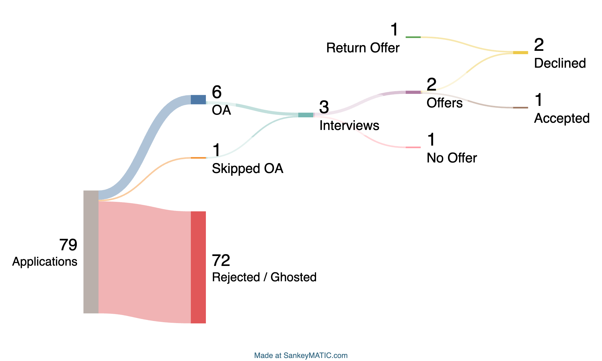

## Overview
The 2024 hiring season has been an incredibly difficult time for computer science students looking for new grad software engineering roles. One look at the csMajors subreddit and you'll see countless posts of students struggling to find SWE jobs, and some even with multiple internships under their belt. I consider myself very fortunate to have received 3 job offers in such a competitive year for new grad SWE's, and I wanted to share my experience and the resources that helped me during my job hunt.

<!-- truncate -->

## Background
For context, I'm a senior at the University of Houston studying Computer Science and I'll be graduating this semester in May 2024. I've had 3 SWE internships in the past which were at Amazon Web Services, Optum, and a startup called Buzly. I'm also a teaching assistant for database systems and previously TA'd for an intro to cs courses at my university. I've also been involved in a few cs organizations on campus.

Before I began my new grad job hunt, I had done around 10 technical interviews and solved around 170 leetcode problems.

## Job Hunt

### Timeline
I was aiming for a big tech company so I almost exclusively applied to those companies. Here's a timeline of my job hunt:
- July 2023: Applied to 8 roles - Started my job hunt
- August 2023: Applied to 16 roles
- September 2023: Applied to 25 roles
- October 2023: Applied to 10 roles
- November 2023: Applied to 9 roles
- December 2023: Applied to 5 roles
- January 2024: Applied to 2 roles
- February 2024: Applied to 2 roles
- March 2024: Applied to 2 roles - Ended my job hunt with **3 offers**!

For a more in depth look at my job hunt timeline along with the resume I used to apply to each company, check out my [Notion page](https://www.notion.so/techresumeservices/d4695b3c17954c5cbd9ffdfcc7e30407?v=b1c9971712074110bc34a214cb550caf&pvs=4)

### Stats

In total I applied to 79 roles, received 6 OA's from:
- JP Morgan Chase
    - The OA was on HackerRank and consisted of 2 coding questions similar to leetcode medium-hard questions.
- Stripe
    - The OA was on HackerRank and consisted of 1 coding question with 60 min. to implement - was not a typical leetcode question but more of a object oriented design question. I ultimately ran out of time as there was a lot to implement given the time constraint.
- Okta
    - The OA was a General Coding Assessment (GCA) on CodeSignal and consisted of 4 coding questions - I'm not really good at GCA's so I didn't do well on this OA, I got a 495 (755 on the old scale). Learn more about the GCA's [here](https://support.codesignal.com/hc/en-us/articles/360040370853-What-should-I-expect-when-I-take-the-General-Coding-Assessment-GCA-and-how-is-it-structured).
- Samsara
    - The OA was a General Coding Assessment (GCA) on CodeSignal - I submitted my same score from the Okta GCA.
- Two Sigma
    - The OA was on HackerRank and consisted of 2 coding questions with 75 min. to implement - The questions were difficult Graph amd DP questions and I could only solve one of them with brute force.
- Microsoft
    - The OA was on Codility and consisted of 2 coding questions with 110 min. to implement - The first question was similar to a leetcode hard question. The second question gave Chat-GPT generated code attempting to solve the first question, and I had to debug and fix the code.

Additionally, I was able to skip the OA for Bloomberg due to having participated in the Bloomberg Accelerator Summer School.

Out of those companies, I moved forward to the interview stages for:
- JP Morgan Chase (Final round)
    - 2 interviews + Code for Good Hackathon (both in-person): First was 1 standard behavioral and 1 technical with a leetcode easy question along with random cs questions (how does Python memory management work, what is a database index, etc.). After the interviews, I was evaluated on my performance in the 24-hour hackathon.
- Bloomberg (Phone screen)
    - 1 technical interview with a leetcode medium BFS question that I unfortunately couldn't solve in time.
- Microsoft (Final round)
    - This interview process consisted of 3 rounds: 1 behavioral, 1 technical with a leetcode medium matrix question, and 1 technical question asking me to implement 2 functions for a class.

And from those companies, I received offers from the following:
- JP Morgan Chase
- Microsoft

I also received a return offer from Amazon Web Services.

### Making a Decision
Having been fortunate to receive offers from JP Morgan Chase, Microsoft and a return offer from Amazon Web Services, I had to make the difficult decision on which offer to accept. My criteria for choosing a company was:
- **Interesting work**: I wanted to work on projects focused on backend development, distributed systems, and possibly machine learning.
- **Growth/Learning opportunities**: Are there domain experts I can learn from? Will I be able to grow my career at this company? What's the promotion process like?
- **Culture/Work-life balance**: Are there lots of politics? How long do people usually work? I don't want to burn out.
- **Compensation**: Will I be able to save and invest? Am I able to focus on my work without worrying about money?

After considering all these factors, I decided to accept the offer from Microsoft! I felt that Microsoft had the most interesting work and growth opportunities for me, and I was excited to work on the projects they had lined up for me.

## Resources
Here are some of the resources that helped me throughout my job hunt:
- [Neetcode](https://neetcode.io/) - Has a great collection of leetcode problems such as Blind 75 and Neetcode 150.
- [cscareers.dev](https://discord.gg/cscareers) - Discord server with like-minded individuals who are also going through the SWE job hunt. I found their leetcode-bot useful for seeing frequently asked question by companies.
- [Leetcode Cheatsheet](https://www.piratekingdom.com/leetcode/cheat-sheet) - Contains time complexity for common patterns as well as tricks for solving common leetcode problems.
- [Notion](https://www.notion.so/) - Useful for keeping track of my job applications and solutions to leetcode problems.
- [Glassdoor](https://www.glassdoor.com/index.htm) - Helped me prepare for behavioral interviews by looking at common questions asked by companies.

## Takeaways
Start early! I started my 2024 new grad job hunt in July 2023 during my internship and I'm glad I did because it gave me enough time to prepare for interviews and not miss out on any job applications for companies I was aiming for. 

I also recommend keeping track of your job applications - you can find the template I used [here](https://www.notion.so/techresumeservices/d4695b3c17954c5cbd9ffdfcc7e30407?v=b1c9971712074110bc34a214cb550caf&pvs=4). The key things I track for each application are the company, role, date applied, location, an image of the job description, and the resume I used to apply. This helped me prepare for interviews by looking at the job description and the resume I used to apply.

I also recommend keeping track of your leetcode solution - I used Notion for this as well which you find [here](https://www.notion.so/techresumeservices/8d545e3f235341a583fc6237625dd7da?v=42d8f6e6281c486b84667b8fa37041b2&pvs=4). Keeping track of your solutions along with a short description on how you solved it will help you in the future when you're reviewing for interviews without the need of having to redo the problem. 

Lastly, maintain a positive attitude throughout the job hunt - it's a long and grueling process but it's worth it in the end.

Good luck!
