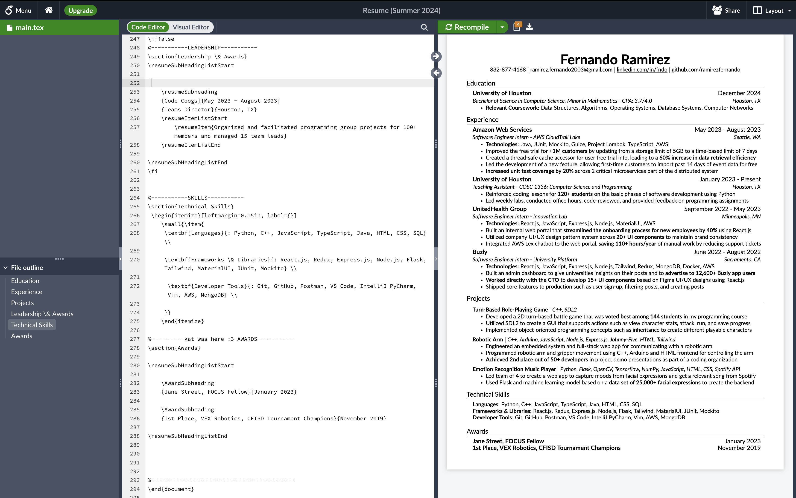

For the past 7 months, I've been using GitHub instead of Overleaf to store my resume and it's been a game changer.

<!-- truncate -->

## The Problem with Overleaf
Overleaf is an online LaTeX editor which can be used to write resumes using LaTeX. I initially used Google Docs for writing my resume but I liked the flexibility that LaTeX provided me when it came to structuring my resume. At the time, I just wanted something to be able to edit LaTeX documents - so I went with Overleaf. Using LaTeX was the right choice for me, but I began to have some issues with Overleaf. 

### History of Resume Edits
For one, if I ever need to look back on an old resume whether it's because I'm re-adding a project and need to see how I wrote down the bullet points for it, or for memory's sake - I'm only able to see the last 24 hours of edit history on Overleaf (that is if I don't want to pay at least $21/month for [Overleaf Standard](https://www.overleaf.com/user/subscription/choose-your-plan?itm_campaign=history)). I don't even pay for [Spotify Premium](https://www.spotify.com/us/student/) and that's only $5.99/month for students - but that's besides the point. If only there was a free alternative that could allow me to keep track of my resumes entire edit history.

### Sharing My Resume on My Website
I have a [personal website](https://www.fernandoramirez.me) where I have button that you can click on that takes you to my resume. In order to achieve this, each time I update my resume on Overleaf, I need to also update it on my website. Manually updating my resume on my website is so much work since I have to download the PDF of my resume from Overleaf and then upload it to my website. I have to do this every time I update my resume on Overleaf. And I update my resume often because I'm always adding new projects, experiences, and skills. And recruiters might be lurking on my website so I want to have my most up to date resume on there. If only there was a way I can automate this process.

A potential solution to this is to share my resume by turning on link sharing on Overleaf, that way anyone with this link can view my resume. All I have to do is have the button lead to my resumes public link and now anyone can see my resume without me having to manually add my resume to my website! But there were 2 problems with this:
1. If I ever create a new resume project on Overleaf (which I did often since I have multiple resumes), I would need to manually change the existing public link to the new projects public link.
2. The page people see after clicking on my resumes public link is gross looking.

I want people to see my resume and nothing else.

What can keep track of my resumes entire edit history while also automating the process of sharing my resume on my website?

## Solution
I found a solution to my problems by using GitHub to write my resume! Here's how I did it:

### Viewing My Entire Resume Edit History
I created a new repository on GitHub called [resume](https://github.com/ramirezfernando/resume) where I transferred my resume from Overleaf to this repository. I can now edit my resume using VSCode and once I'm done, I commit and push my changes and now able to view my entire history of resume changes. That covers the issue I had with Overleaf's history - but when It comes to automating the process of sharing my resume on my website, I needed to get a little creative.

### Automating my Resume Sharing on My Website
In order to automate the process of sharing my resume on my website I use a Makefile, which you can learn more from [here](https://www.gnu.org/software/make/manual/make.html). I created a Makefile in my resume repository that has a target called `pdf` which generates a PDF of my resume. I also have a target called `png` which generates a PNG of my resume. Lastly, I have a target called `resume` which generates both a PDF and PNG of my resume. 
```makefile title="Makefile"
resume: pdf png

pdf:
	pdflatex Fernando_Ramirez_Resume.tex
	open Fernando_Ramirez_Resume.pdf &
	rm -f *.aux *.log *.toc *.blg *.out *.bbl

png:
	convert -density 300 -trim Fernando_Ramirez_Resume.pdf -quality 100 Fernando_Ramirez_Resume.png
	convert Fernando_Ramirez_Resume.png -background white -flatten Fernando_Ramirez_Resume.png
	rm -f Fernando_Ramirez_Resume-*.png
```

:::note

Keep in mind that these commands are specific to macOS. If you're on Windows or Linux, you'll need to change the `open` command to `start` or `xdg-open` respectively. You'll also need to install `pdflatex` and `imagemagick` to run these commands.

:::

Now all I have to do is run `make resume` in my terminal and my resume is generated in both PDF and PNG format. I then commit and push my changes to GitHub. I do this every time I update my resume. GitHub provides a link to the raw version of the PDF and PNG of my resume which I can use to share on my website. Now I can have my website button lead to the [raw PNG version of my resume](https://raw.githubusercontent.com/ramirezfernando/resume/main/Fernando_Ramirez_Resume.png) (my link will remain the same even after I edit my resume).

## Conclusion
Using GitHub to write my resume has been a game changer for me. I'm now able to keep track of my entire resume edit history and automate the process of sharing my resume on my website. I edit my resume in VSCode and use a Makefile to generate a PDF and PNG of my resume. I then commit and push my changes to GitHub where I can use a link of the raw PNG version of my resume to share on my website. With this, I'm able to have my most up to date resume on my website without having to manually update it. I'm very content with my current setup and I don't see myself going back to Overleaf anytime soon. Let me know if you have any questions or suggestions on how I can improve my resume sharing process.

Thanks for reading!

<br />