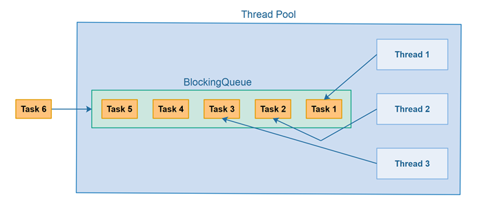

Thread pools are one of several multithreading design patterns that can be used to improve the performance of a program.

<!-- truncate -->

## Background
Multithreading ["is the ability of a central processing unit (CPU) (or a single core in a multi-core processor) to provide multiple threads of execution."](https://en.wikipedia.org/wiki/Multithreading_(computer_architecture)) Multithreading can be useful when a program is performing a task that can be broken down into smaller tasks that can be executed concurrently. An example of this is in one of my recent projects - [Ube](https://github.com/ramirezfernando/ube), my program counts the lines of code in each file starting from a specified directory or file. This task can be broken down into smaller tasks where each thread counts the lines of code in a file (I actually implemented this which you can learn more about [here](https://github.com/ramirezfernando/ube/releases/tag/v2.0.0)!)

## What is a Thread Pool?
A thread pool is a collection of threads that are created once and can be reused multiple times. The benefit to this is by creating once, you avoid the expensive operation of creating and destroying threads for each task (i.e. allocating/de-allocating memory, etc.). A task can be passed into the thread pool which internally is a queue data structure (sometimes referred to as a task or blocking queue) - which follows first-in first-out (FIFO). From there, any idle thread can pop the first task from the queue and perform the task.




## Getting Started With Thread Pools in C++!
For this example, I'll be using [BS::thread_pool: a fast, lightweight, and easy-to-use C++17 thread pool library](https://github.com/bshoshany/thread-pool). One of the pros to using this library is that by default, the number of threads in the pool is equal to the maximum number of threads that the hardware can run in parallel - This is usually determined by the number of cores in the CPU. Any more threads than the hardware can handle will not improve performance, and in fact will most likely hinder it. 

```cpp showLineNumbers
#include "BS_thread_pool.hpp"
#include <iostream>

int main() {
    // Constructs a thread pool with as many threads as available in the hardware.
    BS::thread_pool pool;
    std::cout << pool.get_thread_count();
}
```
```
10
```
This makes sense since I'm using an Apple M1 Pro with 10 total number of cores (8 performance and 2 efficiency).

We'll be simulating concurrent data processing for this example:
```cpp showLineNumbers
#include "BS_thread_pool.hpp"
#include <iostream>

int main() {
    BS::thread_pool pool;
    std::vector<std::future<void>> futures; // Store the futures of the tasks

    for (int i = 0; i < 20; ++i) {
        // Submit a task (using a lambda function) to the thread pool
        futures.push_back(pool.submit_task(
            [i]
            {
                std::cout << i << std::endl; // Print the task number
                std::this_thread::sleep_for(std::chrono::seconds(1));  // Simulate data processing time
        }));
    }

    // Wait for all tasks to complete
    for (auto& future : futures) {
        future.wait();
    }

    std::cout << "All requests handled." << std::endl;
    return 0;
}
```
```
0
56
41
82
79
3


1012

13
11
14
15
17
16
18
19
All requests handled.
```

:::note

The output looks a little messy, but that's likely due to the way the console handles output from multiple threads.

:::

Let's walkthrough the steps of my program! After initializing my thread pool and [futures](https://en.cppreference.com/w/cpp/thread/future) vector, I use a for loop to enqueue 20 tasks to the task queue. As soon as I submit a task to the thread pool, one of my 10 threads will pop from the task queue and process my task - which in this case, printing the task number and simulating data processing time by sleeping for 1 second. Once the task is completed, the thread will be available to process another task. After all tasks are completed, I wait for all the futures to complete and print "All requests handled."

## Final Thoughts
Thread pools remove the performance overhead of having to create and destroy threads for each task. By initializing threads once, you'll be able to reuse existing threads multiple times, making your concurrent programs more efficient ⚡️

Hopefully you learned something new, cause I did! 

<br />